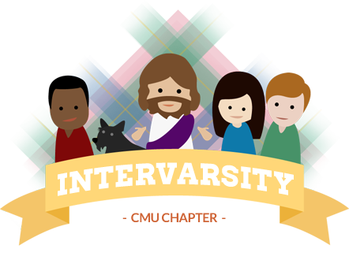

  <article class="frontpage">
    <header>
      
      
Welcome!

    </header>
    

    Welcome to InterVarsity Christian Fellowship! We are a community of students at Carnegie Mellon University who strive to know God and make Him known.
    

    <!--
    

    In conjunction with CMU's Inter-Fellowship Association, we have
    many events going on during orientation week which you may want
    to check out! Head over to IFA's
    <a href="http://www.christatcmu.com/">website</a>
    to see them all.
    

    -->
    

    While we usually love connecting in person, in light of COVID-19 all of our events are virtual. That said, we are still excited to encounter Christ and all of the people he has created. Come join us for Bible study, large group, or other events!
    

    

    This page features the undergraduate multi-ethnic chapter of InterVarsity. There is also a graduate student chapter here on campus! For more information about this ministry please reach out to us at <a href="mailto:ivcf@andrew.cmu.edu">ivcf@andrew.cmu.edu</a> and we will be happy to connect you.
    

    

    To visit or learn more about getting involved, check out our <a href="largegroup.html">Large Group</a> page to learn about our regular gatherings, <a href="smallgroups.html">Small Groups</a> page for our Bible studies, or our <a href="events.html">Events</a> page for other fun happenings. We'd love to have you join us and are looking forward to meeting you!
    

    <!--

    If you're a graduate student, you may want to investigate
    <a href="https://www.andrew.cmu.edu/org/GCF/">GCF</a>,
    InterVarsity's chapter specifically for you.
    
-->
  </article>
